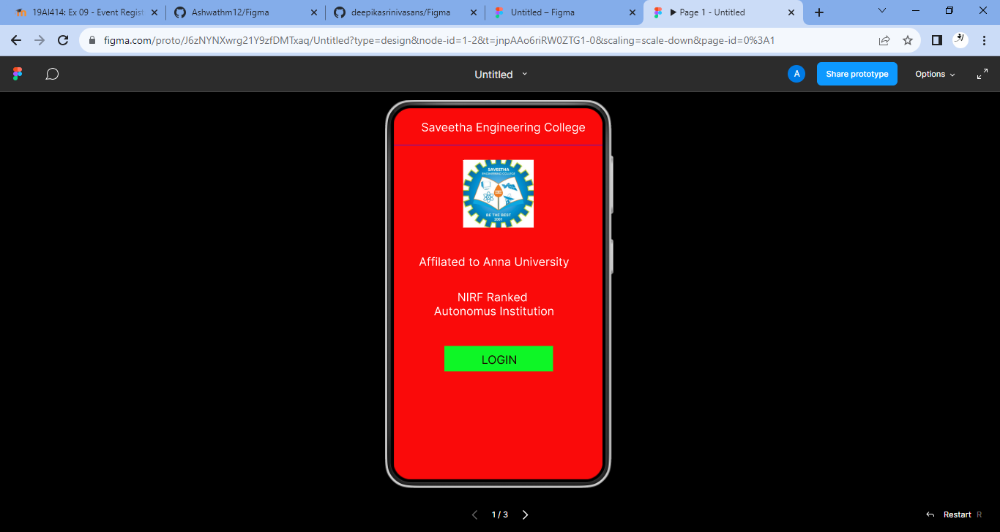
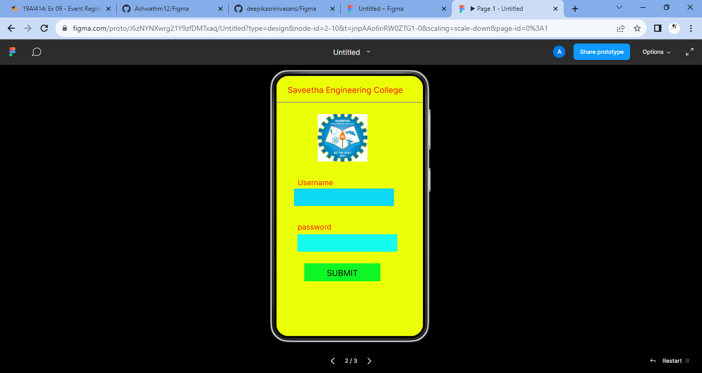
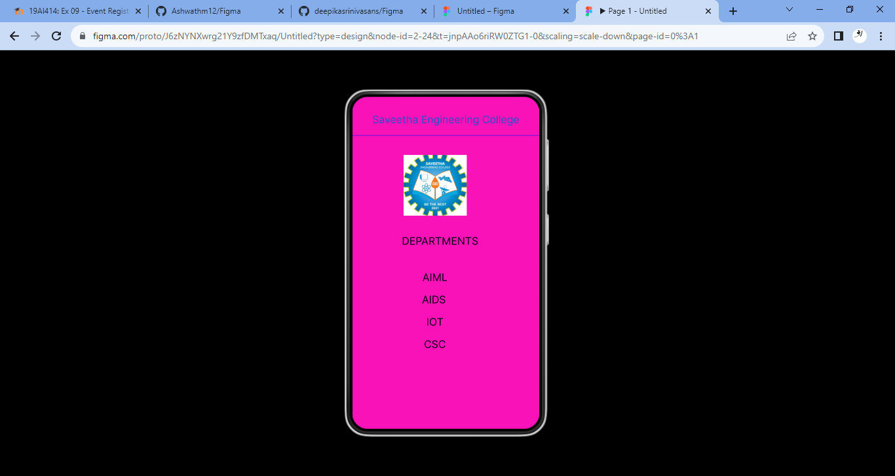

# Event Registration Web Application

## AIM:
To design, develop and deploy a web application for event registration.

## DESIGN STEPS:

### Step 1:
Create a new frame.

### Step 2:
Select any one preset size of your choice.

### Step 3:
Select the shapes you need.

### Step 4:
Import images as needed.

### Step 5:
Create pages based on your need and link them.

### Step 6:

Validate the HTML and CSS code.

### Step 6:

Publish the website in the given URL.

## DESIGN TOOL:
Figma

## code:
```
.home-page {
  background-color: #f90a0a;
  display: flex;
  flex-direction: row;
  justify-content: center;
  width: 100%;
}

.home-page .div {
  background-color: #f90a0a;
  border: 1px none;
  height: 640px;
  position: relative;
  width: 360px;
}

.home-page .text-wrapper {
  color: #ffffff;
  font-family: "Inter-Regular", Helvetica;
  font-size: 20px;
  font-weight: 400;
  left: 36px;
  letter-spacing: 0;
  line-height: normal;
  position: absolute;
  text-align: center;
  top: 20px;
  width: 305px;
}

.home-page .text-wrapper-2 {
  color: #ffffff;
  font-family: "Inter-Regular", Helvetica;
  font-size: 20px;
  font-weight: 400;
  left: 20px;
  letter-spacing: 0;
  line-height: normal;
  position: absolute;
  text-align: center;
  top: 252px;
  width: 305px;
}

.home-page .NIRF-ranked {
  color: #ffffff;
  font-family: "Inter-Regular", Helvetica;
  font-size: 20px;
  font-weight: 400;
  left: 20px;
  letter-spacing: 0;
  line-height: normal;
  position: absolute;
  text-align: center;
  top: 313px;
  width: 305px;
}

.home-page .line {
  height: 1px;
  left: 0;
  object-fit: cover;
  position: absolute;
  top: 63px;
  width: 360px;
}

.home-page .logo {
  height: 117px;
  left: 119px;
  object-fit: cover;
  position: absolute;
  top: 89px;
  width: 122px;
}

.home-page .overlap-group {
  background-color: #0ef625;
  height: 44px;
  left: 87px;
  position: absolute;
  top: 410px;
  width: 187px;
}

.home-page .text-wrapper-3 {
  color: #1c0101;
  font-family: "Inter-Regular", Helvetica;
  font-size: 20px;
  font-weight: 400;
  left: 11px;
  letter-spacing: 0;
  line-height: normal;
  position: absolute;
  text-align: center;
  top: 11px;
  width: 167px;
}
.login-page {
  background-color: #ebff07;
  display: flex;
  flex-direction: row;
  justify-content: center;
  width: 100%;
}

.login-page .div {
  background-color: #ebff07;
  border: 1px none;
  height: 640px;
  position: relative;
  width: 360px;
}

.login-page .text-wrapper {
  color: #f90b0b;
  font-family: "Inter-Regular", Helvetica;
  font-size: 20px;
  font-weight: 400;
  left: 16px;
  letter-spacing: 0;
  line-height: normal;
  position: absolute;
  text-align: center;
  top: 22px;
  width: 305px;
}

.login-page .line {
  height: 1px;
  left: 0;
  object-fit: cover;
  position: absolute;
  top: 65px;
  width: 360px;
}

.login-page .logo {
  height: 117px;
  left: 101px;
  object-fit: cover;
  position: absolute;
  top: 94px;
  width: 122px;
}

.login-page .rectangle {
  background-color: #0dd8f4;
  height: 43px;
  left: 43px;
  position: absolute;
  top: 277px;
  width: 245px;
}

.login-page .img {
  height: 43px;
  left: 52px;
  position: absolute;
  top: 390px;
  width: 245px;
}

.login-page .text-wrapper-2 {
  color: #f81414;
  font-family: "Inter-Regular", Helvetica;
  font-size: 18px;
  font-weight: 400;
  left: 52px;
  letter-spacing: 0;
  line-height: normal;
  position: absolute;
  top: 250px;
  width: 183px;
}

.login-page .text-wrapper-3 {
  color: #f81414;
  font-family: "Inter-Regular", Helvetica;
  font-size: 18px;
  font-weight: 400;
  left: 52px;
  letter-spacing: 0;
  line-height: normal;
  position: absolute;
  top: 359px;
  width: 183px;
}

.login-page .overlap-group {
  background-color: #0ef625;
  height: 44px;
  left: 68px;
  position: absolute;
  top: 461px;
  width: 187px;
}

.login-page .text-wrapper-4 {
  color: #1c0101;
  font-family: "Inter-Regular", Helvetica;
  font-size: 20px;
  font-weight: 400;
  left: 10px;
  letter-spacing: 0;
  line-height: normal;
  position: absolute;
  text-align: center;
  top: 11px;
  width: 167px;
}
.SEC-page {
  background-color: #f711b7;
  display: flex;
  flex-direction: row;
  justify-content: center;
  width: 100%;
}

.SEC-page .div {
  background-color: #f711b7;
  border: 1px none;
  height: 640px;
  position: relative;
  width: 360px;
}

.SEC-page .text-wrapper {
  color: #2251c9;
  font-family: "Inter-Regular", Helvetica;
  font-size: 20px;
  font-weight: 400;
  left: 27px;
  letter-spacing: 0;
  line-height: normal;
  position: absolute;
  text-align: center;
  top: 31px;
  width: 305px;
}

.SEC-page .text-wrapper-2 {
  color: #010612;
  font-family: "Inter-Regular", Helvetica;
  font-size: 20px;
  font-weight: 400;
  left: 16px;
  letter-spacing: 0;
  line-height: normal;
  position: absolute;
  text-align: center;
  top: 265px;
  width: 305px;
}

.SEC-page .text-wrapper-3 {
  color: #010612;
  font-family: "Inter-Regular", Helvetica;
  font-size: 20px;
  font-weight: 400;
  left: 6px;
  letter-spacing: 0;
  line-height: normal;
  position: absolute;
  text-align: center;
  top: 335px;
  width: 305px;
}

.SEC-page .text-wrapper-4 {
  color: #010612;
  font-family: "Inter-Regular", Helvetica;
  font-size: 20px;
  font-weight: 400;
  left: 4px;
  letter-spacing: 0;
  line-height: normal;
  position: absolute;
  text-align: center;
  top: 378px;
  width: 305px;
}

.SEC-page .text-wrapper-5 {
  color: #010612;
  font-family: "Inter-Regular", Helvetica;
  font-size: 20px;
  font-weight: 400;
  left: 6px;
  letter-spacing: 0;
  line-height: normal;
  position: absolute;
  text-align: center;
  top: 421px;
  width: 305px;
}

.SEC-page .text-wrapper-6 {
  color: #010612;
  font-family: "Inter-Regular", Helvetica;
  font-size: 20px;
  font-weight: 400;
  left: 6px;
  letter-spacing: 0;
  line-height: normal;
  position: absolute;
  text-align: center;
  top: 464px;
  width: 305px;
}

.SEC-page .line {
  height: 1px;
  left: 0;
  object-fit: cover;
  position: absolute;
  top: 74px;
  width: 360px;
}

.SEC-page .logo {
  height: 117px;
  left: 98px;
  object-fit: cover;
  position: absolute;
  top: 112px;
  width: 122px;
}
```
## OUTPUT:




## RESULT:
The program to design, develop and deploy a web application for event registration is completed successfully.